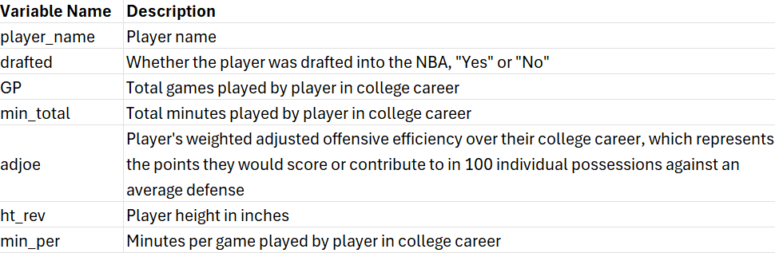
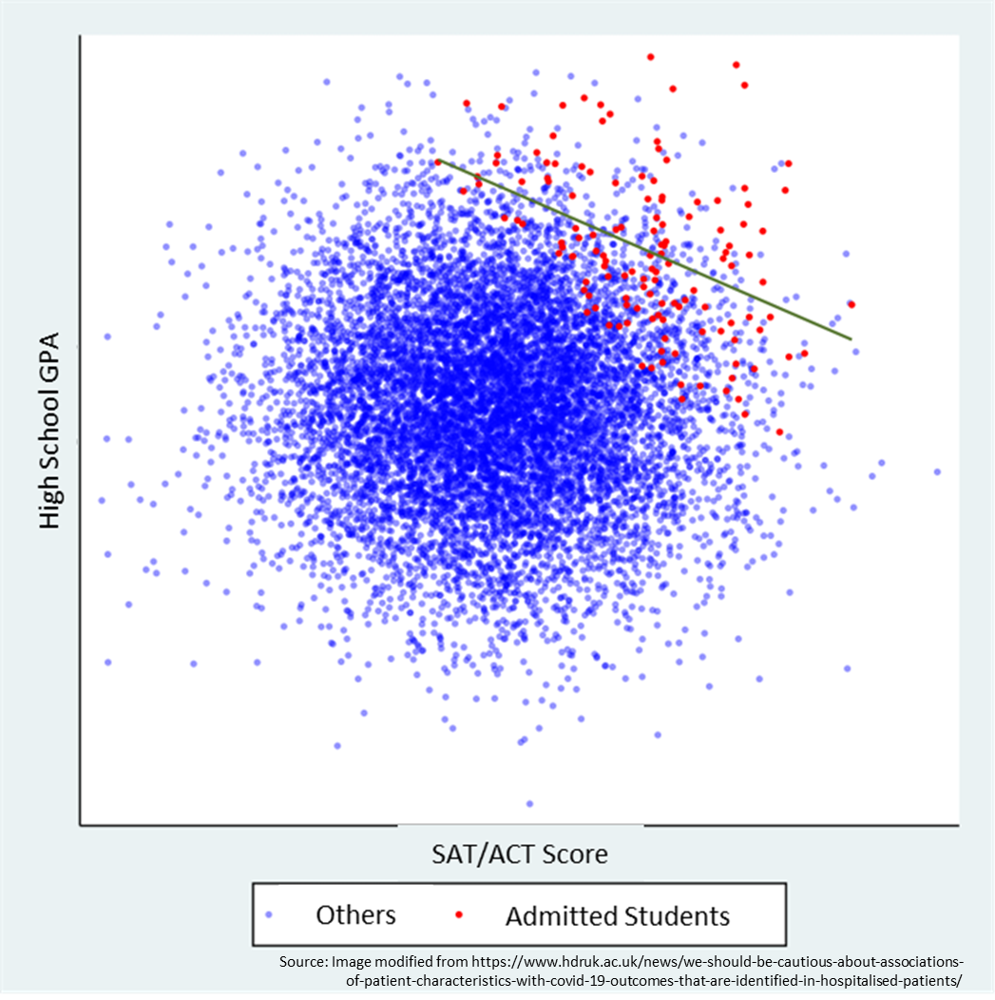

```{r setup, include=FALSE}
## Importing the necessary libraries 
pacman::p_load(learnr, tidyverse, stats, knitr, gridExtra, readxl, cowplot)

## Importing the necessary datasets
cbb <- read.csv("CollegeBasketballPlayers2009-2021.csv")
nba <- read_excel("DraftedPlayers2009-2021.xlsx")
cbb_join <- read.csv("cbb_join.csv") %>% select(-X)
cbb_join_data_dictionary <- read.csv("cbb_join_Data_Dictionary.csv")
```

## Welcome Video

Please watch this intro video from \_\_\_\_\_\_\_\_ to learn more about the question we'll be investigating today!

<iframe src width="640" height="480" allow="autoplay">

</iframe>

## Background

This lesson will focus on the correlation between offensive rating and height.

You might expect there to be a positive correlation between offensive rating and height, as generally taller basketball players should be better, right? And indeed there *is* a modest positive correlation between these variables in college basketball players. But when we get to the more elite NBA players, this disappears - taller NBA players were no better on offense in college than their shorter counterparts. In fact, they may even have been worse! How could that be?! This module will give one explanation for this counterintuitive finding.

We will be begin by exploring some data on college basketball and the NBA draft by conducting some descriptive analyses and visualizations. Then we will show how a concept called Berkson's bias explains the correlation we see in NBA players.

In this process, we will also use linear regression to estimate the association between height and adjusted offensive rating, two continuous variables.

### Basketball Basics

If you aren't familiar with Basketball, consider watching [this introduction video](https://www.youtube.com/watch?v=wYjp2zoqQrs).

In a typical National Collegiate Athletic Association (NCAA) or professional National Basketball Association (NBA) game there are two teams of 5 people trying to shoot the basketball in their opponent's hoop to score points and to see who has more points at the end of either two 20-minute halves (NCAA) or four 12-minute quarters (NBA). The two teams take turns trying to score on one another. 

The way that teams score points in basketball is by shooting the basketball into the basket. "Baskets" are worth varying numbers of points. On the court there is a curved line on each half of the court. Shots/baskets that are made from inside this curved line are worth 2 points, while shots that are made outside of the curved line are worth 3 points. After certain fouls players may also be awarded 1-3 undefended "free throws" 15 feet directly in front of the hoop; each one made is worth 1 point.


### Offensive Rating

To understand Offensive rating in basketball, we must first understand "Per 100 Possession" stats since Offensive rating is built on these.

First, let's define an individual "possession" in basketball is. The short and simple answer is a "possession" is the time one team has the basketball before the other team gets it.

###### The more technical definition (which you can skip if it is confusing you) is that one possession is counted every time a player does one of four things: scores via a field goal (2 or 3-point shot), made free throw, or assist to another player who scores; misses a shot and the defense gets a rebound; misses free throws and the defense gets a rebound; or turns the ball over to the defense without taking a shot.

This helps adjust for teams that play with different "pace" - some games may feature 120 possessions per team if teams shoot or turn over the ball quickly, while others may feature closer to 90.

```{r per100teamq, echo = FALSE}

question("Is it easier for a team to score 100 points in a game where...",
         answer("Each team has 90 possessions."),
         answer("Each team has 120 possessions.", correct = TRUE, message = "Yes! The more chances you have to score, the more points you are likely to score. So simply comparing points scored across teams may mix up how good or 'efficient' a team is at scoring with how many chances it had."),
         answer("It is equally easy in both cases."),
         allow_retry = TRUE
)

```

These stats also allows us to make a farier comparison between men's college games that are 40 minutes long and NBA games that are 48 minutes long.

"Per 100 Possession" stats can also be created for players. In basketball there are 10 players on the court at a time and only one ball, so some players have more possessions with the ball than others, causing them to have more chances to score. To compare players on an equal footing, basketball statisticians created "Per 100 Possession" stats for players, as well, which describe every player's performance as if they had 100 possessions.

Player offensive rating is one such statistic.

```{r per100playerq, echo = FALSE}

question("Why would basketball analysts use per 100 poessession player stats compared to raw counting stats such as points scored?",
         answer("To compare players' scoring ability more fairly", correct = TRUE, message = "Right! A player like Carmelo Anthony might score a lot of points just because he takes a lot of shots even if he misses most of them. Players who can score similar points even though they get the ball less might be more valuable."),
         answer("To reward players that get the ball a lot"),
         answer("To inflate all players counting stats"),
         answer("To measure how entertaining a player is"),
         allow_retry = TRUE
)

```


(Player) offensive rating describes how many points a player would score if given 100 individual possessions. To calculate this, we find how many points a player produces - either by scoring 2 or 3-point field goals, making free throws, assisting other players in scoring, or snagging offensive rebounds - divided by their total possessions, then multiply by 100. The larger the number, the more points they would score given 100 possessions.

The variable we are using today, **adjusted offensive rating**, further corrects for the fact that each team plays different levels of opponents. Adjusted offensive rating is the amount of points that the player would score on a league-average defense given 100 possessions.

```{r adjustedquestion, echo = FALSE}

question("What is the advantage of wanting to use adjusted offensive rating compare to base offensive rating?",
         answer("It adjusts for the amount of games someone played"),
         answer("It only includes the games in which the player wins"),
         answer("It account for the strength of the defenses a player plays against", correct = TRUE,
                message="Accouting for the strength of the defense is important as scoring 100 points on the best defense is much harder than scoring 100 points on the worst defense"),
         answer("It accounts for the strength of the offensive teammates a player plays with"),
         allow_retry = TRUE
         )

```

### Height in Basketball

Height is one of the most important physical attributes in basketball. Basketball favors taller players due to the height of the basket (10 feet) and the vertical nature of the sport. Height influences key aspects of basketball such as shooting, rebounding, and shot-blocking.

```{r heightq, echo = FALSE}

question_text(
  "What are some ways you think being taller might make someone a better basketball player?",
  answer("", correct = TRUE),
  rows = 3,
  correct = NULL,
  incorrect = NULL,
  message = "Example correct answer: From an offensive perspective, taller players have an advantage near the basket since they can shoot over players and score more easily with dunks and layups. They can also secure offensive rebounds and keep a possession alive, allowing for second-chance scoring opportunities. Defensively, taller players can more easily contest shots and protect the rim as well as secure more defensive rebounds."
)
```

## Data Exploration

For our analysis, we have combined 2 data sets.

The data sets we are using were compiled by Aditya Kumar on Kaggle. The first contains data on [most NCAA college basketball players for each season from 2009-2021](https://www.kaggle.com/datasets/adityak2003/college-basketball-players-20092021). For each player and season there is data on advanced offensive and defensive stats as well as player height and other information.

We combined that with NBA draft data that contains a [list of all players that were drafted to the NBA during that same time frame](https://www.kaggle.com/datasets/adityak2003/college-basketball-players-20092021?resource=download&select=DraftedPlayers2009-2021.xlsx). This data set also contains other information like pick number and what college each player attended.

Note in our data adjusted offensive rating is termed adjusted offensive *efficiency* and named `adjoe`. But `adjoe` just means adjusted offensive rating.

First, we want to combine these two datasets, do some data cleaning to get height as a number of inches, and summarize the data to get one row per player (to describe a player's complete college career) rather than one row per player per season.

```{r data_cleaning, warning = FALSE}
# First few rows of original cbb data
head(cbb)

# First few rows of NBA draft data
head(nba)

# Join CBB and draft data, fix height issue, and summarize to one row per player
cbb_join <- cbb %>% 
  # Join information on NBA draft status (yes/no) to college data
  left_join(select(nba, PLAYER, TEAM), by = c("player_name" = "PLAYER")) %>% 
  mutate(drafted = case_when(is.na(TEAM) ~ "No",
                             TRUE ~ "Yes")) %>%
  # Because the data came from Excel heights were mistakenly treated as dates.
  # Example: 6 feet 2 inches was stored as `6-2`, which was interpreted as June 2nd.
  # The code below fixes this issue and stores all height as inches.
  mutate(ht2 = ht) %>% 
  separate(ht2, sep = "-", into = c("ht_in", "ht_ft")) %>% 
  mutate(ht_ft = case_when(ht_ft == "May" ~ 5L,
                           ht_ft == "Jun" ~ 6L,
                           ht_ft == "Jul" ~ 7L,
                           TRUE ~ NA_integer_),
         ht_in = as.integer(ht_in),
         ht_total = ht_ft*12 + ht_in) %>% 
  mutate(ht_rev = case_when(ht == "Jun-00" ~ 72L,
                            ht == "Jul-00" ~ 84L,
                            TRUE ~ ht_total)) %>% 
  # Create some variables in preparation for summarizing the data up to one row
  # per player
  mutate(player_name = str_to_upper(player_name),
         # Total number of minutes played for each player that season
         min_total = GP*Min_per,
         # Year in college
         yr = case_when(yr == "Fr" ~ 1,
                        yr == "So" ~ 2,
                        yr == "Jr" ~ 3,
                        yr == "Sr" ~ 4,
                        TRUE ~ NA_real_),
         # Numerator for weighted adjoe when summarizing below
         adjoe_wt_num = adjoe*min_total) %>% 
  # Summarize data up to one row per player rather than one per player per year
  group_by(player_name, drafted) %>% 
  summarize(
            # Total games played
            GP = sum(GP),
            
            # Total minutes played
            min_total = sum(min_total), 
            
            # Sum of adjoe in each season weighted by minutes played to get 
            # college career total
            adjoe = sum(adjoe_wt_num)/sum(min_total),
            
            # Mean height if measurements varied year to year
            ht_rev = mean(ht_rev)) %>% 
  
  # Minutes per game in college career
  mutate(Min_per = min_total/GP)

```

Let's continue by exploring the final clean data we will be working with, `cbb_join`.

```{r head, exercise = TRUE, exercise.eval = FALSE}
# Print the (first 50 rows of) the data
head(cbb_join, 50)

# Get a summary of the data
summary(cbb_join)

```

Let's also take a look at a data dictionary.



```{r q_explore_rows, echo=FALSE}
question("What does each row represent?",
  answer("A single team's college basketball stats"),
  answer("A single college basketball player's stats for a given season", 
         message = "Not quite! This is what one row in the original `cbb` data represented. There one row corresponds to one player's stats from one season. Most players have multiple rows in this data sets becuase most players compete for many seasons."),
  answer("A single player's career college basketball stats", correct = TRUE,
         message = "That's right! Each row contains variables describing either cumulative (total) or average statistics for a college basketball player's entire college career (through 2021)."),
  answer("A college basketball player's stats for a given game"),
  allow_retry = TRUE
)
```

Now that we know that each row represents a player's stats for his full college career, what do some of the key columns in the data set represent? 

```{r q_explore_gp, echo = FALSE}
question("What does `GP` represent?",
  answer("The number of games a player played in a given season"),
  answer("The number of games a player played in his NCAA career", correct = TRUE, 
message = "That's right!"),
  answer("The number of shots a player made that year"),
  answer("The name of the player's primary care doctor, also called a 'general practitioner'"),
allow_retry = TRUE)

```

```{r q_explore_adjoe, echo = FALSE}
question("What does `adjoe` represent?",
  answer("The average adjusted offensive efficency rating for a player in a given game"),
  answer("The average adjusted defensive efficency rating for a player in a given season"),
  answer("The average adjusted offensive efficency rating for a player in his college career", correct = TRUE, message = "That's correct! The variable `adjoe` stands for the average adjusted offensive efficiency rating for a player across their NCAA career, weighted by how many minutes they played in each year."),
  answer("The number of athetic directors named 'Joe' in a given season"),
allow_retry = TRUE)

```

```{r q_explore_ht_rev, echo = FALSE}
question("What does `ht_rev` represent",
  answer("The height of an individual player in feet"),
  answer("The height of a player in inches", correct = TRUE, message = "That's right! We recoded the variable `ht_rev` to represent the height of a player in inches."),
  answer("The height of a player stored as a date"),
  answer("The height of a player revised to account for their parents' height"),
allow_retry = TRUE)

```

```{r q_explore_drafted, echo = FALSE}
question("What does `drafted` represent?",
  answer("Whether the data is a rough draft or final draft"),
  answer("Whether the player ever experienced a strange gust of cold air during his career"),
  answer("Whether the player was drafted into the NBA", correct = TRUE, message = "That's right!"),
  answer("What round the player was drafted into the NBA"),
  answer("Whether the player is currently riding a few feet off the bumper of the car in front of him to reduce wind resistance and increase fuel efficiency"),
allow_retry = TRUE)

```

Now that we are familiar with the dataset let's look at how our key variables are related to one another.

## Descriptive Correlations of Offensive Rating and Height

### College Offensive Rating and Height Correlation in College Basketball Players

Let's begin by visualizing the association between offensive rating (`adjoe`) and height among *all men's NCAA basketball players* in a scatterplot. We will also include a line depicting an estimated simple linear regression between the two variables.

```{r graph_all_NCAA, exercise = TRUE}
# Data used to create plot
cbb_join %>% 
  # Only include players averaging greater than 5 mins per game
  filter(Min_per > 5) %>% 
  
  # Create scatterplot. Set height as the x-axis and adjoe as the y axis
  ggplot(aes(x = ht_rev, y = adjoe)) + 
  geom_point() +
  
  # Fit a linear regression line through the plot
  geom_smooth(method = "lm") + 
  
  # Set min and max values for x-axis (height)
  xlim(c(60, 90)) + 
  
  # Add title and axis labels
  labs(x = "height (inches)", y = "Adjusted Offensive Rating", title = "Height vs Adjusted Offensive Rating") 
```

```{r q_graph_all_NCAA, echo=FALSE}

question("What relationship does the linear regression show between height and offensive rating in all NCAA men's college basketball players?",
  answer("Negative and linear"),
  answer("Negative and exponential"),
  answer("Positive and linear", correct = TRUE, 
         message = "That's right! This graph shows a modest but positive linear relationship between height and adjusted offensive rating. It is also statistically significant as we will see later."),
  answer("Positive and exponential"),
  answer("No relationship"),
  allow_retry = TRUE
)
```

In the graph among all men's college basketball players, as the height of a player increases, their adjusted offensive rating also rises modestly (about 0.35 points per 100 possessions for each 1-inch increase in height, it turns out).

### College Offensive Rating and Height Correlation in Players Drafted Into the NBA

Now let's look at this same relationship for a more elite group of players who were drafted into the NBA. Importantly, NBA teams tend to prefer taller players and players with higher adjusted offensive ratings.

```{r graph_NBA_only, exercise = TRUE}

cbb_join %>% 
  # Only include players who averaged greater than 5 minutes per game
  # and who were drafted into the NBA
  filter(Min_per > 5, drafted == "Yes") %>% 
  ggplot(aes(x = ht_rev, y = adjoe)) + 
  geom_point() + 
  geom_smooth(method = "lm") + 
  xlim(c(60, 90)) + 
  labs(x = "height (inches)", y = "Adjusted Offensive Rating", title = "Height vs Adjusted Offensive Rating") 

```

```{r q_graph_NBA_only, echo=FALSE}
question("What relationship does the linear regression show between height and offensive rating in NCAA men's college basketball players drafted into the NBA?",
  answer("Negative and linear", correct = TRUE, 
         message = "That's right! This graph shows a modest but negative linear relationship between height and adjusted offensive rating in NCAA Basketball players drafted into the NBA. It is also statistically significant, as we will see later."),
  answer("Negative and exponential"),
  answer("Positive and linear"),
  answer("Positive and exponential"),
  answer("No relationship"),
  allow_retry = TRUE
)
```

As we can see in the graph, among all men's college basketball players who were **drafted into the NBA**, as the height of a player increases, their adjusted offensive rating **decreases** modestly (about -0.22 units for each 1-inch increase in height, it turns out).

```{r conclusion_ncaavsnba, echo = FALSE}

question_text(
  "What have we found so far about the relationship between adjusted offensive efficiency and height in all men's NCAA players versus those just drafted for the NBA?",
  answer("", correct = TRUE),
  rows = 5,
  correct = NULL,
  incorrect = NULL,
  message = "Example correct answer: We saw a modest positive association among all men's NCAA college players, as we would have expected. But we found no relationship, or maybe even the reverse, among the more elite group drafted into the NBA. What could possibly cause this?"
)
```

## Berkson's Bias

The answer to why is a concept called Berkson's bias or Berkson's paradox.

All studies are conducted on a sample of people (or other units) from a bigger population. In our case we could think of NBA players as being a sample from the broader population of all men's college basketball players (or, if thinking more broadly, anyone who plays basketball worldwide, but we did not have information on most of them).

Berkson's Bias is a type of selection bias that occurs when you are trying to correlate two variables, but your sample is selected on both of them. That is, if both variables make selection into your sample more likely, then the correlation in your sample will be *negatively biased* versus the broader population it was drawn from.

A clear example of Berkson's Bias is in college admissions. Whether or not a student is admitted into college is based on various factors, including their high school GPA and SAT/ACT scores. 

If someone has a very high GPA or a very high SAT score, they may be likely to receive admission into a school. 

But if someone has a very high SAT score that might be able to make up for a mediocre GPA and can result in the student still getting admitted. Vice versa, if a student has a mediocre SAT score but a very high GPA, they could still get admitted. 

This selection bias leads to a negative correlation in SAT and GPA of **admitted students**. However, this negative correlation is created by selection and is not representative of the entire population of students applying to college, where high school GPA and SAT/ACT scores are probably positively correlated.

```{r bb_pic, echo=FALSE, out.width="100%", fig.cap="A scatterplot showing Berkson's bias."}

```

The same thing is happening with our basketball players!

```{r q_bb_pop, echo=FALSE}
question("In our basketball data above, which group represents our broader population, from which our sample that will be negatively biased is selected?",
  answer("All NCAA men's college basketball players from 2009-2021", correct = TRUE, 
         message = "That's right! Our broader population that we started with, and later drew a smaller sample from, is all NCAA men's college basketball players from 2009-21."),
  answer("All NCAA men's college basketball players drafted into the NBA from 2009-2021", ),
  answer("Some other group."),
  allow_retry = TRUE
)
```

```{r q_bb_sample, echo=FALSE}
question("In our basketball data above, which group represents our sample that is selected on both the variables we are trying to correlate, height and adjusted offensive rating?",
  answer("All NCAA men's college basketball players from 2009-2021"),
  answer("All NCAA men's college basketball players drafted into the NBA from 2009-2021", correct = TRUE, 
         message = "That's right! NBA teams select players to draft from all men's college basketball based, in part, on both their height (taller players more likely to be drafted) and adjusted offensive efficiency (higher means you are more likely to be drafted)."),
  answer("Some other group."),
  allow_retry = TRUE
)
```

```{r explain_berksons, echo = FALSE}

question_text(
  "Do your best to explain how Berksoon's bias is operating in our basketball example using your own words.",
  answer("", correct = TRUE),
  rows = 5,
  correct = NULL,
  incorrect = NULL,
  message = "Example correct answer: The positive relationship we observed between height and adjusted offensive efficiency among *all* NCAA men's college basketball players will be 'pushed down' - negatively biased - among NBA draftees because that latter group was selected positively on both offensive rating (adjoe) and height."
)
```

The underlying idea is that if a player is very tall, NBA teams may still draft them even if their adjusted offensive efficiency in college was just "good" rather than "great." But if a player is not very tall, they must have had something else, such as a well above average offensive rating, to compensate. 

That means shorter players will, on average, have needed a better offensive rating than taller players to be selected into our group of drafted players. That is what biases our correlation downward from a modest positive correlation to a modest negative correlation.

In other cases, the bias might take us from a large positive correlation to a smaller positive correlation or no association. The only thing Berkson's bias guarantees is that the correlation will be "pushed down" in the selected sample versus the broader population if being higher on both variables makes you more likely to be in the sample.

Let's now review our previous findings with our new knowledge of Berkson's bias in mind. Look at our two earlier scatterplots side by side.

```{r scatterplots_side_by_side}
# Recreate scatterplots from all men's college players and NBA players on the same
# plot
cbb_join %>% 
  filter(Min_per > 5) %>% 
  ggplot(aes(x = ht_rev, y = adjoe)) +
  geom_point(alpha = 0.3) + 
  geom_smooth(method = "lm", color = "black") + 
  geom_smooth(data = filter(cbb_join, Min_per > 5, drafted == "Yes"), color = "red", method = "lm") +
  geom_point(data = filter(cbb_join, Min_per > 5, drafted == "Yes"), color = "red", alpha = 0.5) +
  xlim(c(60, 90)) +
  labs(x = "Height (inches)", y = "Adjusted Offensive Rating", title = "Height vs Adjusted Offensive Rating in Men's College Basketball", subtitle = "Red Dots = Drafted by NBA") 

```

```{r q_sidebyside_plots, echo=FALSE}
question("How would you summarize our findings in these scatterplots?",
  answer("There is a positive relationship between the characteristics in all players and NBA draftees."),
  answer("There is a negative relationship between the characteristics in all players but a positive one in NBA draftees."),
  answer("There is a positive relationship between the characteristics in all players but a negative one in NBA draftees.", correct = TRUE, 
         message = "That's right! This indicates a negative bias in the correlation for NBA draftees due to Berkson's bias."),
  answer("There is a negative relationship between the characteristics in all players and NBA draftees only."),
  allow_retry = TRUE
)
```

## Quantifying Berkson's Bias Using Linear Regression

Now let's explicitly calculate the associations between height and adjusted offensive rating among all men's NCAA basketball players and only those who were drafted to the NBA. 

For this we will use simple linear regression that uses height to predict adjusted offensive rating using a formula that looks very much like the equation for a straight line, `y = mx + b`:

$$AdjOffRtg=β0 + β1*Height $$

(Note we are ignoring error terms here for simplicity.)

Here is the code to create this model:

```{r linreg_full_college, exercise = TRUE}
 # Linear regression of height on offensive rating for all men's college players
  summary(lm(data = filter(cbb_join, Min_per > 5), formula = adjoe ~ ht_rev))

```

There is a lot of output here, but the key information is located in the Coefficients table.

The Estimate column of the Coefficient table contains the numbers needed to fill in our equation. The `(Intercept)` line is β0 while the `ht_rev` line is β1. Thus, the equation is:

$$AdjOffRtg=67.77 + 0.35*Height $$

Since height is measured in inches, this means that for every additional 1 inch in height we expect on average an increase of .35 in adjusted offensive rating.

Now let's look at this same regression just for NBA draftees.

```{r linreg_draftees, exercise = TRUE}
 # Linear regression of height on offensive rating for NBA draftees only
  summary(lm(data = filter(cbb_join, Min_per > 5, drafted == "Yes"), formula = adjoe ~ ht_rev))

```

```{r q_linreg_drafted, echo=FALSE}
question_text(
  "Interpret the linear regression results for drafted players as we did above for all men's college players.",
  answer("", correct = TRUE),
  rows = 5,
  correct = NULL,
  incorrect = NULL,
  message = "Example correct answer: We saw a decrease of ~0.22 in adjusted offensive rating per additional inch in height. Our full regression equation is AdjOffRating = 137.0104 - 0.22*Height."
)
```

This is another way to illustrate Berkson's bias. We see there is a positive association between offensive rating and height among all men's college players but it turns negative among NBA draftees.

## Conclusion

```{r q_concusion1, echo = FALSE}

question_text(
  "Why is there a negative relationship between height and offensive rating among NBA players while it is positive in all college players? Answer using a statistical concept you learned in this lesson.",
  answer("", correct = TRUE),
  rows = 5,
  correct = NULL,
  incorrect = NULL,
  message = "Example correct answer: Berkson's bias. While there is a positive correlation between these characteristics among men's college basketball players, it was negative among NBA players. This is because Berkson's bias pushes the correlation negatively in the 'selected' sample of NBA players."
)
```

```{r q_conclusion2, echo = FALSE}
question_text(
  "What do these results reveal about the behavior of NBA front offices when it comes to choosing which players to draft?",
  answer("", correct = TRUE),
  rows = 5,
  correct = NULL,
  incorrect = NULL,
  message = "Example correct answer: NBA teams select players on both offensive rating and height, allowing one to 'trade off' for another and causing a negative correlation. Front offices may be more willing to overlook players with worse offensive skills if they are very tall, but shorter players need to be good at offense otherwise they have a low chance to be drafted. And vice versa."
)
```

The draft process is complex, and teams are balancing multiple factors. When drafting players, front offices are willing to overlook lowered stats in one desired category for benefits in another category. Therefore, taller players can afford to have worse offensive skills because their height is such an advantage, and players who have exceptional offensive skills can still get drafted even if they are not very tall. Another way of looking at this is from the opposite perspective: shorter players need to be very good at offense otherwise they will not get drafted, and players who are not very good on offense may need to be very tall otherwise they might not get drafted.

### Statistical Lesson

```{r q_conclusion_stats, echo = FALSE}

question_text(
  "How did statistics help us answer this question? What methods did we use? ",
  answer("", correct = TRUE),
  rows = 5,
  correct = NULL,
  incorrect = NULL,
  message = "Example correct answer: We used scatterplots and linear regression to assess how offensive rating and height are correlated in all men's college basketball players and only those drafted to the NBA. We then used Berkson's bias to explain why the correlation in the NBA players was negative while in college players it was positive."
)
```

**Berkson's Bias could explain a counterintuitive correlation in any sample that is selected from a broader population you might be interested in on the two variables you are correlating.** Examples include:

* Professional athletes as a selected sample of all athletes in a given sport
* Hospitalized patients as a selected sample of all patients with a disease
* Admitted college students as a selected sample of college applicants

And on and on. 

**Where Berkson's bias may lurk we must be careful to avoid: 1) treating the correlation as if it describes a causal effect (that is, if you somehow made NBA players taller their offensive ratings would rise) and 2) generalizing the correlation in the selected group (such as NBA players) to others (such as college or high school players) because Berkson's bias is inherently making the correlation more negative in the selected group.**

Berkson's bias has also resulted in studies showing obesity is beneficial for survival among patients with cardiovascular disease and that smoking was protective among hospitalized COVID-19 patients. If we interpreted correlations as causal effects without recognizing Berkson's bias we could make some very dangerous health recommendations.

Note this does not mean we have the "wrong" correlation in our selected sample. The correlation between offensive rating and height in NBA players really is negative! It just runs counter to what we expect to see (and indeed do see) in broader groups of basketball players where height and offensive rating show a positive correlation. 